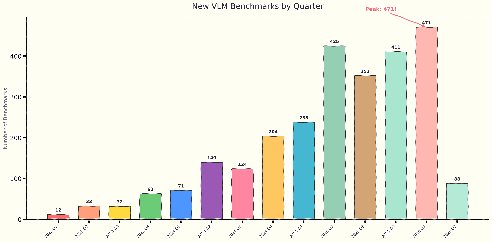
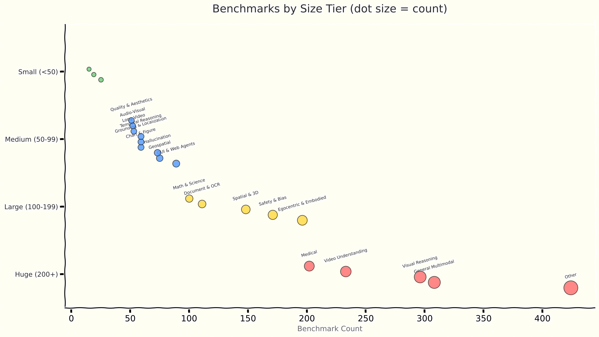

# VLM Benchmarks

A comprehensive, auto-updating catalog of **2,742 benchmarks** for evaluating Vision-Language Models (VLMs), Multimodal LLMs, and Video Understanding models.

Updated daily via automated arXiv scanning.

**[Search all benchmarks →](https://vlm-benchmarks-search.vercel.app)**

<p align="center">
  
</p>

<p align="center">
  
</p>

## Data

Available in two formats:

- [`data/benchmarks.json`](data/benchmarks.json) — structured, programmatic access
- [`data/benchmarks.csv`](data/benchmarks.csv) — spreadsheet-friendly

### Schema

| Field | Description |
|-------|-------------|
| `benchmark_name` | Name of the benchmark |
| `category` | Classification (see categories below) |
| `num_samples` | Number of samples/questions/videos |
| `modalities` | Input modalities (image, video, text, audio, 3D) |
| `task_types` | Evaluation tasks (MCQ, open-ended QA, captioning, etc.) |
| `description` | What makes this benchmark distinct |
| `repo_links` | GitHub/HuggingFace links for code and data |
| `paper_title` | Full paper title |
| `arxiv_id` | arXiv identifier |
| `arxiv_url` | Link to arXiv page |
| `published` | Publication date |
| `authors` | First 5 authors |

### Quick start

```python
import json

with open("data/benchmarks.json") as f:
    benchmarks = json.load(f)

# Filter by category
video = [b for b in benchmarks if b["category"] == "video_understanding"]

# Find benchmarks with data available
has_data = [b for b in benchmarks if b["repo_links"]]
```

## Categories

22 categories spanning general multimodal, visual reasoning, video understanding, medical, safety, spatial, document/OCR, and more. See the dotstrip chart above for the full breakdown.

## How it works

A daily GitHub Action scans arXiv for new VLM benchmark papers, classifies them using Claude, extracts repository links, and commits any new entries to this repo.

## Contributing

Found a benchmark we missed? Open an issue or PR with the arXiv ID.

## License

MIT

---

Built by [Overshoot](https://overshoot.ai)
